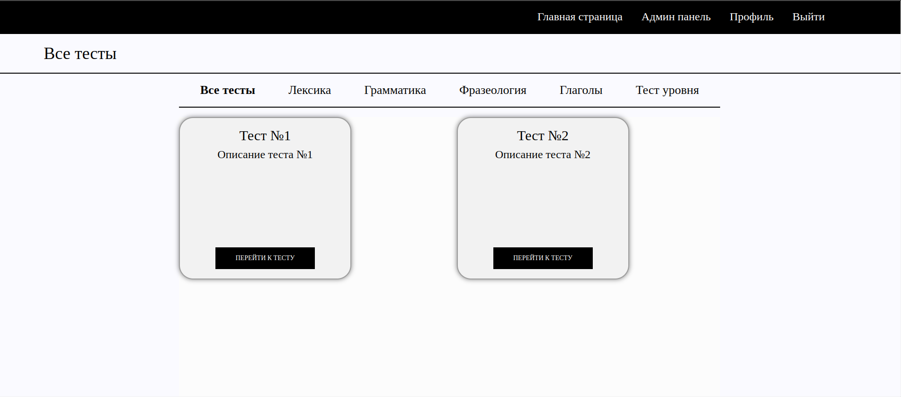

# Проект для университета для тестов
## Стек проекта
- Django 4.2.1
- PostgreSQL
## Описание
- В проекте есть разделение на учителей и учеников. Учителя через админку могут создавать тесты с заданиями, а ученики проходить их через основной интерфейс.
## Изображение главной страницы
<p></p>

## Запуск проекта
Для начала создайте файл .env по примеру .env.example.  
После этого создайте виртуальное окружение, запустите его и установите зависимости:
```bash
python3 -m venv venv
source venv/bin/activate
pip install -r requirements.txt
```
Теперь запускаем базу данных на фоне:
```bash
docker-compose up -d
```
Создаём миграции для базы данных:
```bash
python3 manage.py makemigrations
python3 manage.py migrate
```
Создаём суперпользователя:
```bash
python3 manage.py createsuperuser
```
Запускаем проект:
```bash
python3 manage.py runserver --insecure
```